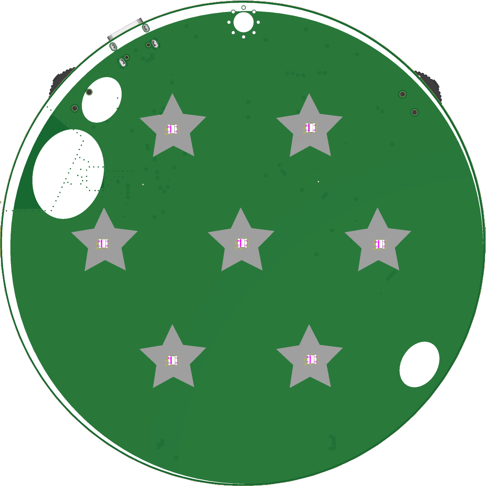
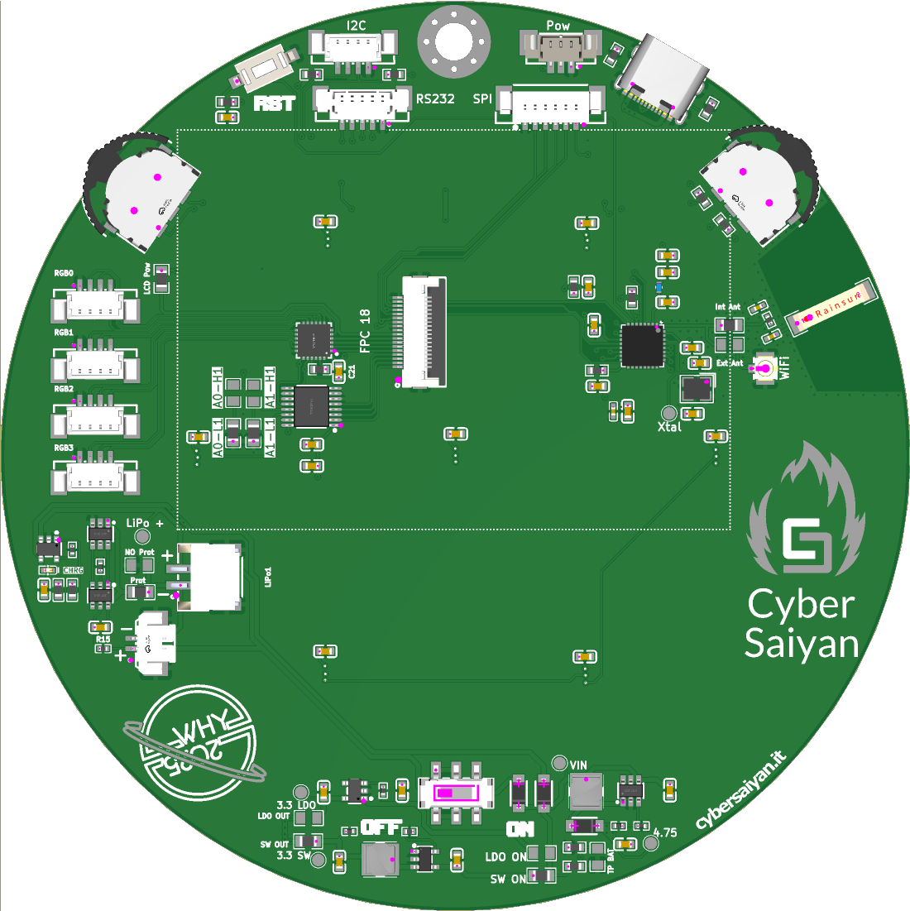

# WHY2025 Badge

Cyber Saiyan community has designed and developed a special gadget to celebrate [WHY2025](https://www.cybersaiyan.it/why2025/), inspired by the [RomHack Camp 2022 badge](https://romhack.io/badge/).

You can play with the badge during WHY2025 at [Cyber Saiyan Village](https://wiki.why2025.org/Village:Cyber_Saiyan) where will be 200 badges available to buy and play with.
Some useful information:
* In order to start playing around with and hacking it, is recommended to bring a USB Type‑C data cable with you
* The badge is already flashed with the WHY2025 specific firmware
* We would greatly appreciate any improvements to the project and pull requests.
* Don't hesitate to come and visit us at the Cyber Saiyan Village if you need help
* Bonus: on [Day 2, Aug 9, 2025 at 16:00 in Cassiopeia](https://cfp.why2025.org/why2025/talk/3CSQRF/) we will present the hardware design and the firmware during the talk "Summoning Shenron: Building the Cyber Saiyan Badge"

## Features

The badge has some very simple features that will improve your Camp experience:
* It is designed to recall the dragon spheres (maybe you will be able to summon Shenron too)
* The base SOC is a low power ESP32-C3 
   * Integrates a 32-bit single-core RISC-V microcontroller with a maximum clock speed of 160 MHz
   * 400 KB of internal RAM and 4MB flash
   * WiFi and Bluetooth 5 (LE)
   * 16 programmable GPIOs
* In the front there are 7 RGB leds
* In the back you have  
   * A 2.8'' TFT screen 
   * A LiPo battery, connectors and power switch
   * A reset button
   * 2 Dial Wheel Switch
   * 8 connectors for configurable GPIOs and expansions

Once powered the badge will be assigned a 1-7 ID and will start to advertise itself using BLE and the screen will show the Cyber Saiyan WHY2025 logo 
* You can move to next/prev screen by a 1s long press on the Dial Wheel Switch
* The 1st screen is the Cyber Saiyan Village schedule: 
   * You will be able to read the schedule of the Camp (use the 4th screen to update it)
* The 2nd screen is the badges' radar: 
   * You will see all the badges around you in a dragon ball style
* The 3rd screen is the badge's list: 
   * You will see all the badges around you in a table view
* The 4th screen is for the WiFI functionalities: 
   * Start the AP mode and connect with your PC/smartphone in order to explore more functionalities
   * Start the schedule SYNC mode in order to update the schedule at the 2nd screen
* The 5th screen is for fun (you will be able to play with snake)

## Characteristics

The ESP32-C3 chip is the MCU at the core of the WHY2025 Badge, it integrates multiple peripherals to enable communication with the outside world.
The number of available pins is limited to keep the chip package size small. To route all the incoming and outgoing signals a set of software programmable registers controls the pin multiplexer.

### Peripheral Interfaces
There are 16 programmable GPIO pins available for:
* Digital interfaces
   * 3 SPI
   * 2 UART
   * I2C
   * I2S
   * Remote control peripheral, with 2 transmit channels and 2 receive channels
   * LED PWM controller, with up to 6 channels
   * Full-speed USB Serial/JTAG controller
   * General DMA controller (GDMA), with 3 transmit channels and 3 receive channels
   * TWAI® controller compatible with ISO 11898-1 (CAN Specification 2.0)
* Analog interfaces
   * 2 SAR ADCs (12-bit), up to 6 channels
   * Temperature sensor

### Devices on board
The WHY2025 Badge is equipped with a 2.8 inch TFT color LCD screen with 240 x 320 pixels, using the [ST7789](hardware/datasheet/ST7789V.pdf) display controller.
This display integrates a resistive touchscreen a white LEDs backlight and features an 18-pin standard FPC cable to interface the MCU with a 4-wire SPI bus.
___
The SPI bus signals are available on the connector labeled "SPI" at the top of the badge:
| pin  | function |
| :--- | :------: |
| 1    |   GND    |
| 2    |   MOSI   |
| 3    |    CS    |
| 4    |    DC    |
| 5    |   CLK    |
| 6    |   MISO   |

___
The current firmware version does not support touchscreen functionality, but the Badge still features the [TSC2007](hardware/datasheet/tsc2007.pdf) I2C Resistive Touch Screen Controller.

The front RGB LEDs are intelligent, individually addressable [WS2812B](hardware/datasheet/WS2812B.pdf) chips that communicate with each other and the microcontroller via a single data line. The data transfer protocol uses a single NZR communication mode. The signal from the DOUT port of the last LED on the badge is available on the "1W" pin of the connector, labeled "I2C."
___
The I2C bus signals are available on the connector labeled "I2C" at the top of the badge:
| pin  | function |
| :--- | :------: |
| 1    |   GND    |
| 2    |   SCL    |
| 3    |   SDA    |
| 4    |    1W    |
___
The display backlight is controlled by 4 pins on the [AW9523B](hardware/datasheet/AW9523.pdf) LED driver and GPIO controller with I2C interface while the other 12 pins on the I/O ports can be configured as LED drive mode or GPIO mode and are available on the connector labeled "RGB*".
___
The I/O signals from AW9523B are available on the connector labeled "RGB*" at the left of the badge:
| RGB0 | function |
| :--- | :------: |
| 1    |   GND    |
| 2    |   P0_0   |
| 3    |   P0_1   |
| 4    |   P0_2   |

| RGB1 | function |
| :--- | :------: |
| 1    |   GND    |
| 2    |   P0_3   |
| 3    |   P0_4   |
| 4    |   P0_5   |

| RGB2 | function |
| :--- | :------: |
| 1    |   GND    |
| 2    |   P0_6   |
| 3    |   P0_7   |
| 4    |   P1_4   |

| RGB3 | function |
| :--- | :------: |
| 1    |   GND    |
| 2    |   P1_5   |
| 3    |   P1_6   |
| 4    |   P1_7   |
___

The Badge's main input interface consists of two buttons arranged on a Thumbwheel Dial Toggle Switch. The left and right toggle dial wheel switch perform the same functions as rotating the wheel UP or DOWN. Pressing the center of the left switch results in the same effect as rotating the wheel UP, while pressing the center of the right switch results in the same effect as rotating the wheel DOWN.

Note: 
push the left switch (or rotating the wheel UP) during boot to put the MCU in Joint Download Boot mode to download binary files into flash using UART0 or USB interface. To reset/restart the MCU push the micro switch labeled "RST" on the top left of the badege.

During the boot process, the messages by the ROM code can be printed to (Default) UART0 and USB Serial/JTAG controller. 
___
The UART interface and the Strapping (button pin) signals are available on the connector labeled "RS232" at the top of the badge:
| pin  | function |
| :--- | :------: |
| 1    |   GND    |
| 2    |    TX    |
| 3    |    RX    |
| 4    | button B |
| 5    | button A |

___

The USB-C connector D+/D- pins are connected to the defult USB Serial/JTAG Controller and the USB power is routed to the LiPo battery charger and the voltage regulators.

There is the [MT3608](hardware/datasheet/MT3608B.pdf) step-up converter intended for power the WS2812 with up to 5V and the [MT3410LB](hardware/datasheet/MT3410LB-N.pdf) step-down DC-DC 3.3V regulator, capable of delivering up to 1.3A output current to the MCU and all the other IC.

In case of low power and low noise applications it's possible to disable the MT3410LB by removing two 0 ohm resistors labeled SW_ON/SW_OUT and enable the [RT9080](hardware/datasheet/RT9080-33.pdf) low-dropout (LDO) 3.3 voltage regulator by shorting two resistors pads labeled LDO_ON/LDO_OUT
___
The power lines are available on the connector labeled "POW" at the top of the badge:
| pin  | function |
| :--- | :------: |
| 1    |   GND    |
| 2    |  +3.3V   |
| 3    |  +4.75V  |
___

The battery is charged using a [TP4054](hardware/datasheet/TP4054.pdf) single-charge LiPo charger with a constant current/voltage algorithm and a [DW01](hardware/datasheet/dw01a.pdf) protection IC designed to protect the battery from damage due to over-discharge and/or over-current. The charging circuit and voltage regulators are always powered by the USB port. A toggle switch for turning the badge on and off via the battery is located on the bottom of the badge.

___
___
# Toolchain setup

## Prepare the environment 

### Visual Studio Code (VSCode)
Install Visual Studio Code as development environment:

* https://code.visualstudio.com/ - follow instructions there, if you don't have vscode yet.

### PlatformIO (PIO) extension
Install PlatformIO extension on Visual Studio Code:

* [Installation](http://docs.platformio.org/page/ide/vscode.html)
* [Quick Start](http://docs.platformio.org/page/ide/vscode.html#quick-start)
* [User Guide](http://docs.platformio.org/page/ide/vscode.html#user-guide)

Please follow to the official documentation [PlatformIO IDE for VSCode](http://docs.platformio.org/page/ide/vscode.html).

## Setup the project

* Git clone this repository and open it on VSCode

If you get the error message "No module named pkg_resources", you need to open the 'PlatformIO Core CLI' and execute command:
   * `pip install setuptools`

## Build www data (Linux)

* Prerequisites:
   * Install Node.js and NPM
* Use NPM to Install required Packages:
   * `npm install node-minify node-sass`

* `./www-build.sh`

## Build www data (Docker)

* Install docker
* `docker build --pull --rm -f "Dockerfile" -t why2025badge:latest "."`
* (Bash) `docker run -it -v $(pwd)/public:/public -v $(pwd)/data/www:/output why2025badge`
* (Powershell) `docker run -it -v ${PWD}/public:/public -v ${PWD}/data/www:/output why2025badge`
   
## Build/Upload Filesystem

In order to upload the filesystem to the badge you need to plugin the badge using USB.
In the "Project Tasks" view of PIO navigate to:

* WHY2025-Bagde
   * Platform
      * Build Filesystem Image
      * Upload Filesystem Image

## Build/Upload Firmware
In order to upload the firmware to the badge you need to plugin the badge using USB.
In the "Project Tasks" view of PIO navigate to:

* WHY2025-Bagde
   * General
      * Build
      * Upload

# Known Issues
* none (yet)

# Misc

## WiFi SSID name lenght limit

The WiFi SSID name configure to connect to external AP is limited to 20 chars

## Use a different logo image

To use a different logo first you need to 
* convert the BMP/JPG/PNG/SVG file to a C array; you can do this using an [online image converter](https://lvgl.io/tools/imageconverter): use LVGL v8, CF_TRUE_COLOR_ALPHA as color format and and C array as output
* adjust [main/badge/common/img_logo.c](main/badge/common/img_logo.c) file
